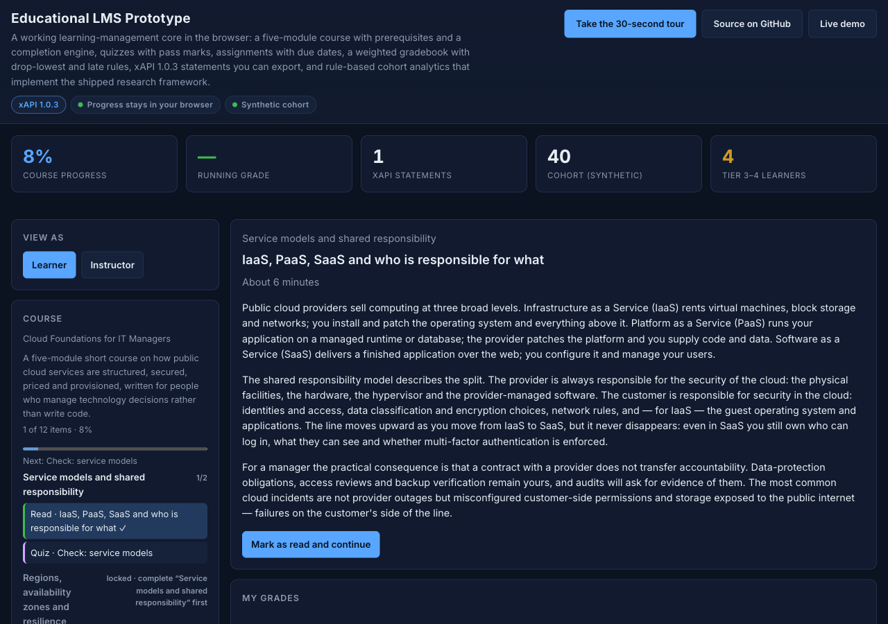
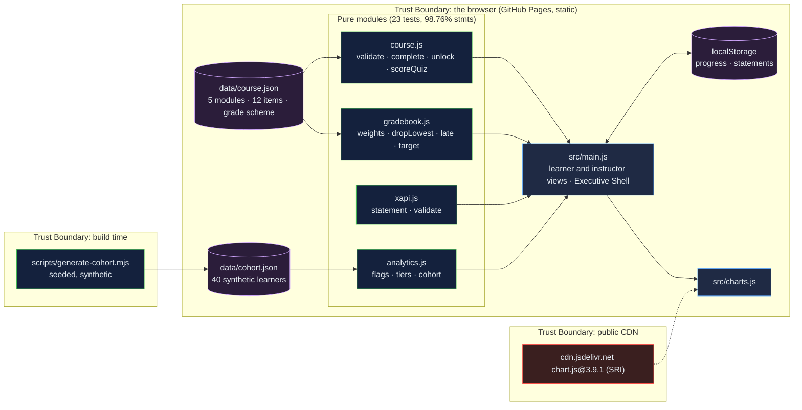

# Educational LMS Prototype: a working course engine, gradebook and xAPI log in the browser, with analytics that cite their thresholds

[](https://github.com/Freddricklogan/Educational-LMS-Prototype/actions/workflows/deploy.yml)
[](#5-getting-started--verification)
[](https://github.com/Freddricklogan/Educational-LMS-Prototype/actions/workflows/codeql.yml)
[](LICENSE)
[](https://freddricklogan.github.io/Educational-LMS-Prototype/)

## 1. Executive Summary & Business Impact

**Problem statement.** LMS "prototypes" are usually screenshots with a
sidebar: a student named Alex, a GPA typed into a card, progress bars
set by CSS width, and charts drawn from arrays. The previous version of
this page was that, next to two research documents it did not use
(`AUDIT.md`).

**Solution & value delivered.** A learning-management core that runs in
the browser: a five-module short course (Cloud Foundations for IT
Managers) with prerequisites that lock, readings, quizzes scored
against a key with pass marks, and assignments with due dates; a
weighted gradebook with drop-lowest, late penalties and the average
needed to reach a target; an xAPI 1.0.3 statement log for every action,
exportable as JSON; and an instructor view that applies the thresholds
and intervention tiers from the shipped learning-analytics framework to
a seeded synthetic cohort, saying plainly that no predictive risk score
is computed. Progress stays in the learner's browser; nothing is
transmitted.

**[→ Read the full case study](docs/CASE_STUDY.md)**



## 2. Demonstrated Competencies & Technical Skills

- **EdTech Systems & Standards** — course structure validation,
  completion and prerequisite semantics, quiz scoring and pass marks,
  xAPI 1.0.3 statements with ADL verb and activity-type IRIs, a
  gradebook with explicit rules.
- **Learning Analytics** — rule-based engagement and performance flags
  and intervention tiers implemented exactly as the framework document
  specifies (logins, content access, on-time rate, running grade,
  declining runs, inactivity), with the framework's risk score
  deliberately not fabricated.
- **Accessibility & Human-Centered Design** — real buttons with
  `aria-pressed`, disabled (not hidden) locked items, labelled radio
  fieldsets, `aria-live` results, focus moved to the item view.
- **Engineering Practice** — four pure modules at 98.76 % statement
  coverage including failure paths; seeded cohort generator; strict CSP
  and SRI; no `innerHTML`.

## 3. System Architecture & Data Flow



No backend, no account, no telemetry. The xAPI statements are stored
under an anonymous learner id in the browser and leave it only when the
learner exports them.

## 4. Technical Highlights & Engineering Decisions

### ADR-1 — Completion is a pure function over a progress record

**Context.** The old "78 % progress" was a CSS width.

**Decision.** `course.js` defines completion per item type (reading
opened; quiz passed at its pass mark on the best attempt; assignment
submitted), module completion as all items complete, and unlocking as
the required module being complete. `nextItem` walks that order. State
transitions are pure and return new records.

**Consequence.** The whole engine is tested without a DOM, including a
full run to course completion and the case where a later, lower quiz
attempt must not reduce the best score.

### ADR-2 — Gradebook rules are explicit, validated and reversible

**Context.** A GPA appeared with no computation behind it.

**Decision.** A scheme is validated (weights sum to 1, integer
drop-lowest, penalty in 0–1). Missing work counts as zero unless
excused; drop-lowest never drops the only entry; late days round up and
the penalty is capped by `maxLateDays`; categories with no scores are
omitted and the rest renormalised so a grade exists from the first
score. `neededForTarget` inverts the weights to say what average the
remaining work needs.

**Consequence.** Every rule has a hand-computed test, and the learner
sees the rule text beside the number.

### ADR-3 — Implement the shipped framework; refuse to invent a risk score

**Context.** The repository already contained a learning-analytics
framework with thresholds and tiers; the page ignored it.

**Decision.** `analytics.js` encodes those thresholds as constants and
evaluates each learner into engagement and performance flags and a
tier. The framework's probabilistic risk score needs training data the
prototype does not have, so the page states it is not computed.

**Consequence.** The instructor view can be checked line by line
against the document it claims to implement, and a reader can change
one constant and see every tier move.

## 5. Getting Started & Verification

**Prerequisites.** Node 22 LTS. No build step; the page is served from
the repository root.

```bash
git clone https://github.com/Freddricklogan/Educational-LMS-Prototype.git
cd Educational-LMS-Prototype
npm ci
npm run lint && npm run validate && npm run coverage
npx serve .    # open http://localhost:3000
node scripts/generate-cohort.mjs   # regenerate the synthetic cohort (seeded)
```

**Verification — the numbers this repository actually produced:**

```bash
npm run coverage   # 23 passed / 23; All files 98.76% stmts, 88.56% branches
npm run lint       # 0 problems
npm run validate   # html-validate index.html: clean
```

| Check | Result |
| --- | --- |
| Unit tests (Vitest) | **23 passed / 23** across 4 files |
| Coverage (pure modules) | **98.76%** statements, **88.56%** branches (`main.js`, `ui.js`, `charts.js` covered by the browser smoke test) |
| ESLint, html-validate | clean |
| Course file | 5 modules, 12 items, 20 quiz questions, validator reports 0 problems |
| Synthetic cohort | 40 learners, seed 430, as of 2026-09-20 (week 7 of 10): tiers 26 / 10 / 1 / 3, mean 3.5 sessions per week, 79.5 % content access, 72.5 % on-time, 78.1 % running grade |
| Headless Chrome smoke | **0 console errors**; 10 of 12 items locked at start; quiz at 50 % fails and keeps Module 2 locked, 100 % passes and unlocks it (7 locked); 13 statements after one module with verbs experienced, attempted, answered, failed, passed; assignment submission counted 60 words; progress and statements restored after reload; running grade 100 % A with target math "78 % on the remaining 92 %"; instructor view 40 rows with flag text; reset clears to 0; four tour steps; no horizontal scroll at 1280 or 400 px |

## 6. Live Demo & Production Showcase

**<https://freddricklogan.github.io/Educational-LMS-Prototype/>**

**30-second guided walkthrough.** Press **Take the 30-second tour**: it
shows the locked modules, opens the first quiz, raises your target grade
to see the required average change, and switches to the instructor
view with its tiered cohort. Then work through the course; your progress
and xAPI statements stay in this browser until you export or clear
them.
